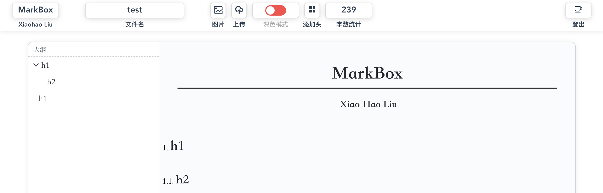

# MarkBox 


A Markdown application powered by **vue**, **vditor** and **element**. This app is a pure web page without any backend for data interactions. Thus, it's **convenient** to build your own markdown app.



I designed the MarkBox with many necessary and useful Features as follows:

- add images
- login
- count 
- upload to your gitee repo
- file manager (open an online file)
- dark mode
- ...


Here is a [demo](http://wykxldz.gitee.io/mindbox/?u=WYKXLDZ&r=MindBoxCollection&s=3746793b39d93d69f05aaac9ac39035ec3ae5544&n=Demo.mb) without gitee storage.

Enjoy it!

## Deploy
For the security, I add a simple server that can valid your identification and send the private gitee/github info to you.

First, set a json of settings of `pm2`:
```json
// start.json
{
	"apps":[
		{
		"name":"MarkBox",
		"script":"/opt/MarkBox/server.js", // the absolute position of your serve app.
		"env":{
			"GITEE_USER":"Xiaohao", //User Name
			"GITEE_TOKEN":"xxxxxx", //token 
			"MINDBOX_REPO":"xxxxxx", //repos
			"MINDBOX_GITEE_ENABLE":1 // enable the Gitee (1 recommended)
			}
		}
	]
}
```
Next, start your server by pm2:
```shell
pm2 start start.json

#│ id │ name               │ mode     │ ↺    │ status    │ cpu      │ memory   │
#├────┼────────────────────┼──────────┼──────┼───────────┼──────────┼──────────┤
#│ 1  │ MarkBox            │ fork     │ 0    │ online    │ 0%       │ 41.8mb
```